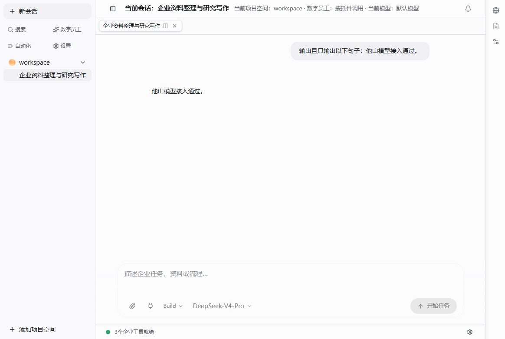

# TashanWork

TashanWork 是他山企业 AI 工作台的公开版本。它面向企业知识工作、数字员工、项目空间、资料处理、任务流和本地优先运行场景，目标是让团队可以在自己的文件和工作区里组织 AI 助手、技能包和工具调用。



## 当前定位

- **企业工作台**：以项目空间、会话、任务流和资料处理为核心，而不是单纯聊天窗口。
- **数字员工入口**：把插件、技能包、MCP 工具和权限策略组合成可配置的数字员工能力。
- **本地优先**：桌面端优先连接本地工作区和本地运行时，模型提供商通过本地配置接入。
- **可审计执行**：任务、工具调用、权限确认和运行事件都应成为可追踪的产品对象。
- **企业扩展**：组织、SSO、审计、市场分发和私有化部署能力在企业层继续演进。

## 已包含能力

- TashanWork 桌面壳和工作台 UI。
- 项目空间、会话列表、中文化导航和 TashanWork 品牌入口。
- 数字员工视图和预置头像资产。
- 预制技能包，包括科研写作、论文检索、AIGC 检测、幻觉核查、可视化 PPT、科研图像生成等。
- 模型提供商配置入口和 SCNet/DeepSeek 兼容验证脚本。
- 发布治理脚本，检查品牌残留、密钥风险和基础工程门禁。

## 截图来源

README 中的截图来自本仓库本地运行的 TashanWork Electron 验证流程，保存在 `docs/assets/tashanwork-workbench.png`。不要使用上游产品截图、动图、官网素材或营销图片替换它。

## 快速开始

```powershell
pnpm install
pnpm typecheck
pnpm --dir apps/desktop typecheck:electron
pnpm --dir apps/desktop dev
```

Windows 目录包构建：

```powershell
pnpm --dir apps/desktop package:electron:dir:no-resource-edit
```

发布前门禁：

```powershell
node scripts/tashan-release-gate.mjs
node scripts/tashan-seed-skills.mjs --workspace <temp-workspace>
```

## 模型配置

模型密钥必须放在本地环境变量或被 git 忽略的运行时配置中，不能提交到源码、截图、日志或报告。

```powershell
$env:TASHAN_LLM_BASE_URL="https://example.com/api/llm/v1"
$env:TASHAN_LLM_API_KEY="<redacted>"
$env:TASHAN_LLM_API_TYPE="openai-completions"
$env:TASHAN_LLM_MODEL="DeepSeek-V4-Pro"
```

真实模型验证：

```powershell
node scripts/tashan-scnet-e2e.mjs
node scripts/tashan-electron-scnet-demo.mjs
```

## 工程结构

- `apps/app`：TashanWork 工作台前端。
- `apps/desktop`：Electron 桌面壳和本地运行时桥接。
- `apps/server`：本地服务、会话和事件接口。
- `apps/orchestrator`：本地运行时启动入口。
- `packages/*`：共享类型、UI 基础能力和工具包。
- `skills/tashan-prebuilt`：TashanWork 预制技能包。
- `scripts/tashan-*.mjs`：TashanWork 发布、模型、技能和桌面验证脚本。
- `outputs/*.md`：阶段性治理报告和提交说明。

## 数字员工模型

TashanWork 的数字员工不是简单的列表卡片，而是以下能力的组合：

- 角色提示词和业务职责。
- 一个或多个技能包。
- MCP 工具或插件能力。
- 模型偏好。
- 权限策略。
- 项目空间和资料访问范围。

当前版本先复用底层插件、技能和 MCP 配置能力，后续再把数字员工市场、组织分发、权限审计和私有化控制面独立实现。

## 发布规范

提交和发布前至少确认：

- `node scripts/tashan-release-gate.mjs` 通过。
- `pnpm typecheck` 通过。
- `pnpm --dir apps/desktop typecheck:electron` 通过。
- 不提交本地 `.env`、API key、运行日志或 loop evidence。
- README 只使用 TashanWork 自有截图和自有说明。

## 许可证与归属

本仓库包含上游 MIT 许可组件、企业扩展目录和 TashanWork 产品层改造。重新分发源码或二进制包时，需要保留相应许可证与 copyright notice，并在商业发布前复核企业扩展目录的许可边界。
